# Frozen Wasteland VCV plugins

A collection of unusual plugins that will add a certain coolness to your patches.

## BPM LFO

- Tempo Sync'd LFO.
- CV Control of Time Multiplication/Division to create LFOs sync'd to some ratio of clock
- Phase Control allows LFOs to be offset (cv controllable). 90° button limits offset to 0, 90, 180, 270 degrees.
- Pairs well with the Quad Algorithmic Rhythm
- When Holding is active, the Outputs stay at last value
- Hold input can either be a gate (which switches each time) or momentary (active while signal is positve)
- If set to Free, LFO still runs while being held (even if outputs don't change), Pause causes LFO to pause.

## BPM LFO 2

- Variation of original BPM LFO.
- CV Control of Time Multiplication/Division and Wave Shape
- Slope control interpolates between selected waveform and a sin wave
- Skew either moves between sawtooth and triangle waves or controls duty cycle of square wave
- Phase Control allows LFOs to be offset (cv controllable). 90° button limits offset to 0, 90, 180, 270 degrees.
- Can either be variable sawtooth/triangle or variable duty cycle square wave

## BPM LFO PhaseX

- Expander for both BPM LFO and BPM LFO 2 offering multiple phase outputs.
- Phase Division specifies the equal phase spacing of the outpus (CV Controllable)
- Integer button forces dision to be integer value, turning it off allows smooth slewing between divisions

## Damian Lillard
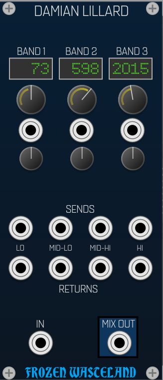
- Voltage Controlled Quad Crossover
- Use Sends/Returns to apply FX to different frequency domains of input signal
- Basic example, distort only the mid lows and/or mid highs so your distortion doesn't remove bottom end
- or, apply different delays to create interesting resonances and other FX
- Video of a snare drum being fed into four delay lines: https://www.youtube.com/watch?v=EB7A_hzMpNI

## Drunken Rampage
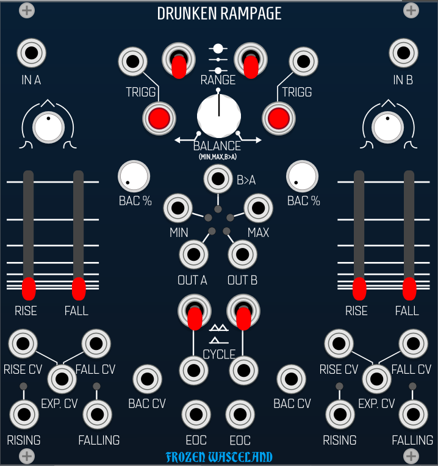
- Based on Befaco's Rampage module
- New BAC % control makes DR randomly overshoot input voltage (depending on how drunk you have set the channel, it may take a couple tries to reach it)

## Everlasting Glottal Stopper

- Based on the Rosenburg model of human's larynx
- Pairs well with the Vox Inhumana
- Can be a bit fussy to create harmonically "rich" waves, but playing with the "Closed" setting can find some sweet spots
- Use the Noise parameter to add a "breathy" quality to wave

## The Gardener

- Master controller for Seeds of Change (and other sequencers)
- Allows nested sequences of repeated patterns.
- Connect Reseed output to SoC's reseed input to get sequence to repeat every "Reseed Div" clock count
- Connect New Seed Trigger to a source of seed values (say a sequencer or LFO)
- Delay Compensation delays output of Clock Out and Reseed Out triggers by n samples, so that a seed generated by new seed trigger is ready at output in time
- Seed In and Out are polyphonic and there is a delay compensation for the split and merge needed
- Gardener's can be chained together for complex orchestrations of controlled randomness. Check out Dieter Stubler's work.

## Hair Pick
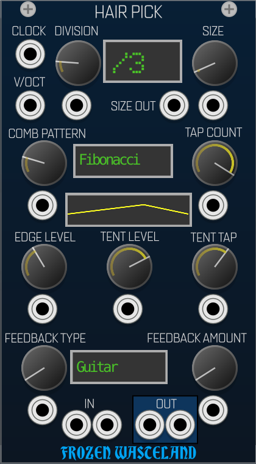
- Based on the comb filter section of Intellijel/Cylonix Rainmaker
- Best bet is to refer to this: https://intellijel.com/wp-content/uploads/2016/01/rainmaker_manual-v109.pdf
- Comb filter size is either based on Clock & Division or Size Parameter - patching a clock in disables Size knob
- V/Oct works using either method
- The Size CV can change size +/- 10% using both Clock or Size
- There are 16 comb patterns, the last 8 are randomly perturbed versions of the first 8
- The Tap count can vary the number of taps between 1 and 64. They are deactivated in a pattern shown in the rainmaker manual
- The Edge Level, Tent Level and Tent Tap control the overall volume of the taps.
- Feedback Type can add non-linearity and exponential decay. Clarinet mode is same as guitar for now.
- The size out allows the comb's length to control other modules (say the feedback delay time in Portland Weather)

## Just a Phase(r)
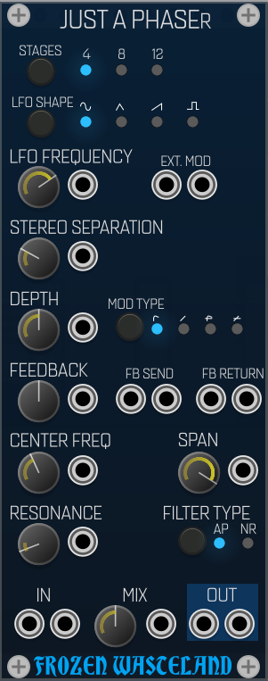
- Classic Phaser effect with control over nearly everything
- Mod Type controls how the notches are modulated - either logarithmic, constant, logarithmic with notches alternating directions and constant with notches alternating directions
- Span controls the range of the notches, at 100% it is about 4 octaves

## Lissajou LFO.

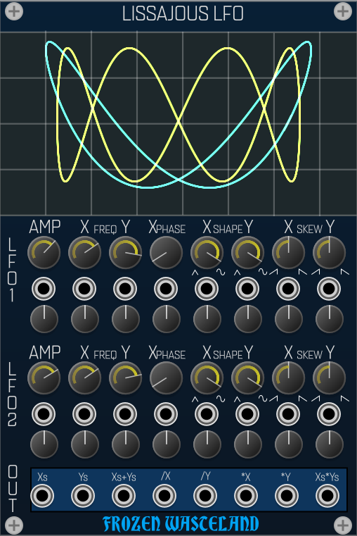

- Loosely based on ADDAC Systems now discontinued 502 module https://www.modulargrid.net/e/addac-system-addac502-ultra-lissajous
- Each LFO is actually a pair of LFOs (x and y)
- Adjusting them will show harmonic relationship between the two
- Phase of the X oscillators can be adjusted in relation to its Y oscillator
- Shape control allows interpolation between tri/sawooth and sin waveshape
- Skew control moves waveshape between sawtooth - triangle - reverse sawtooth
- Yellow is LFO 1, Blue is LFO 2
- Output 1: (x1 + x2) / 2
- Output 2: (y1 + y2) / 2
- Output 3: (x1 + y1 + x2 + y2) / 4
- Output 4: x1/x2
- Output 5: y1/y2
- Output 6: x1 * x2 (essentially ring modulating them)
- Output 7: y1 * y2
- Output 8: x1 * x2 * y1 * y2

## Mr. Blue Sky

- Yes, I love ELO
- This is shamelessly based on Sebastien Bouffier (bid°°)'s fantastic zINC vocoder
- Generally you patch something "synthy" to the carrier input
- The voice sample (or I like to think "harmonically interesting" source) gets patched into the Mod input
- Each modulator band is normalled to its respective carrier input, but the patch points allow you to have different bands modulate different carrier bands
- You can patch in effects (a delay, perhaps?) between the mod out and carrier in.
- CV Control of over almost everything. I highly recommend playing with the band offset.
- You can either CV the value of the band offset, or send triggers to the + and - Inputs to increment/decrement the offset

## The One Ring (modulator)

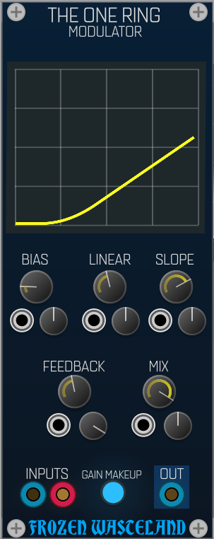

- Ring modulation essentially multiplies the two frequencies together, creating non-harmonic sidebands
- Doing RM digitally is easy - just multiply the two signals. But it was tougher to do with an analog circuit.  The traditional design used 4 diodes.
- This module is based on this paper: http://recherche.ircam.fr/pub/dafx11/Papers/66_e.pdf which describes how to model an analog ring modulator with all its quirks
- Let's you simulate different types of diode response as used in analog ring modulators
- Bias is the input voltage level where the diode responds - below that the diode outputs 0V
- Linear is the input voltage level where the diode outputs a linear response. Between the Bias and Linar levels, the diode acts 'weird' or let's say 'harmonically interesting'
- Slope is the strength of the diode output
- The graph display is useful for seeing the diodes' voltage responses
- CV control over everything
### Ring Modulation
- Ring Modulation has always appealed to the math nerd in me, because while the process is pretty straightfoward, the results are really cool.
- example. If you feed into a RM a 200hz sine wave and a 500hz sine wave, the output is the sum and difference of those two frequencies, so 300hz and 700hz.
- Where it gets crazy is when harmonics are involved since the output is the sum and difference of "all" the frequencies. example, let's say you had the 200 and 500hz sine waves, but they both each had a 2nd harmonic as well, so a 400hz and 1000hz. The output would be: 500+200=700,1000+200=1200,500+400=900,1000+400=1400,500-200=300,500-400=100,1000-300=700(again),1000-400=600. So a whole slew of new frequencies got created.
- Most waveforms have *way* more harmonics than this, so the results are really crazy.
- The Dalek Voices in the original Dr. Who were done using ring modulators. Eliminate!!!

## Phased Locked Loop (PLL)

- Inspired by Doepfer's A-196 PLL module
- This is a very weird module and can be kind of "fussy". Recommend reading http://www.doepfer.de/A196.htm
- Added CV control of the LPF that the 196 did not have
- Added Pulse Width and Pulse Width Modulation of the internal VCO
- Generally you want to "listen" to the **SQR OUT**
- You'll want to feed a Square-ish wave into Signal In
- Low **LPF FREQ** settings create a warbling effect, high = craziness
- **EXTERNAL IN** overrides interal VCO
- The **LPF OUT** is normalled to the **VCO CV**, try patching something in between the two
- Four comparator modes: XOR, D type Flip Flop use different boolean logic. Fuzzy XOR and Fuzzy Hyperbolic XOR use logic operators based on work by Lofti Zadeh and hyperbolic parabolas respectively
- Does not make pretty sounds, but can be a lot of fun.

## Portland Weather
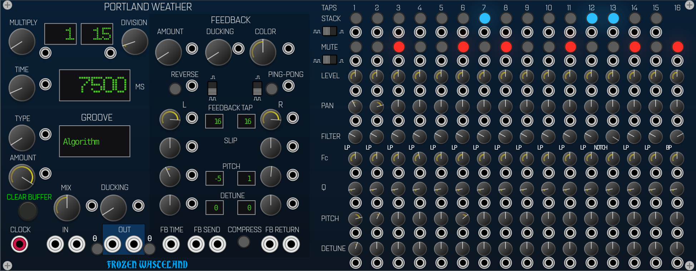
- Based on the rhythmic tap delay section of Intellijel/Cylonix Rainmaker

### This is a crazy deep module and is best just to play with. 
### Since it is a "rhythmic" delay, short duration or percussive sounds generally work best

- Best bet is to refer to this: https://intellijel.com/downloads/manuals/cylonix-rainmaker_manual.pdf
- Delay time is either based on Clock & Division or Size Parameter - patching a clock in disables Size knob
- There are 16 delay groove patterns. The groove amount balances the delay time between the groove or straight time
- Stacking a tap makes the tap use the delay time of its neighbor to right. If multiple taps are stacked the right most tap controls time
- Stacking is useful for making chords
- Each tap has its own level, pan, filter type, cutoff, Q, pitch shift and pitch detune control
- The left and right channels can independently use a tap # to determine where feedback comes from (the feedback bypasses the filter and pitchshifting)
- The feedback slip controls allow the feedback to be ahead/behind the tap time for dragging effects, etc.
- If feedback tap is set to All, the mix of all 16 taps is fed back (use cautiously)
- If feedback tap is set to Ext, the feedback time input is used. Useful for sycing with say, the Hair Pick
- Reverse mode reverses direction of input buffer - time is based on feedback time
- Ping Pong feeds the L feedback into the right channel and vise versa
- FB Send and Returns allow you to insert FX into the feedback loop
- In Context Menu, the Grain Number and Grain Size control how the all the pitch shifters work. "RAW" is uses one grain sample but without the a triangle window

## Probably Not(e)

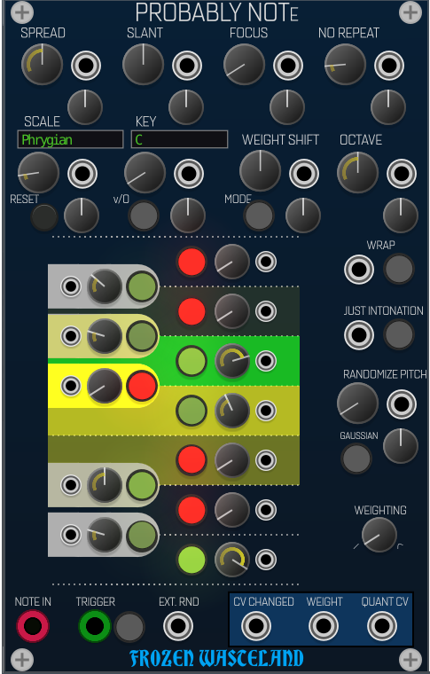

- This is a probabilistic quantizer that will use weighted probabilities to quantize note to a scale
- This is based on the ideas of Dieter Stubler
- Input voltage is first quantized to nearest note
- Spread Control allows other notes to be possibly chosen
- Slant Control controls the direction of notes to choose (either below, above, or both)
- Focus Control controls initial probability, at 1 all notes have equal probability, at 0 furthest notes have a probability of 10%, with a linear increase towards center note
- Then within the context of key/scale an additional probability is used - by default, the root and fifth (V) of the scale have the highest proability of being selected.
- If a note is off (red) it will not be selected by the Quantizer
- These probabilities can be changed by the knobs or CV.
- The Save button will overwrite the default weights for a scale. The initialize option from the context menu will restore.
- If Octave Wrap is enabled, notes will stay within the Note In's octave (so a B could would be 11 half-steps above a C), if Octave Wrap is off, the notes will be near the original value
- Octave control allows shifting of the output
- The Shift control moves the weightings of the active notes up or down - this can be used to move between modes within a scale (ie c major to a minor)
- If v/Oct is enabled the Key inputs use a 1v/Oct scaling so the key can follow other quanitizers or MIDI keyboards
- Shift has 3 modes, with the light off, the shift is 1V - per note shift (+ or -). Blue is a v/Oct of scaling where the shift is relative to the key. 
  Green is v/Oct where the note is absolute (so 0V will shift to C)
- Intonation: off = Equal Temperment, Green = Just Intonation, Blue = Pythagorean tuning
- Intonation has a trigger input that switches between equal and whatever intonation was selected
- Weight outputs the current notes probability weight so it can be used to affect other modules
- Change outputs a trigger anytime the quantized note changes
- Weighting changes the overall weighting from linear (0%) to logarithmic (100%). 
- A more detailed manual will be available soon

## Probably Not(e) - Bohlen Pierce
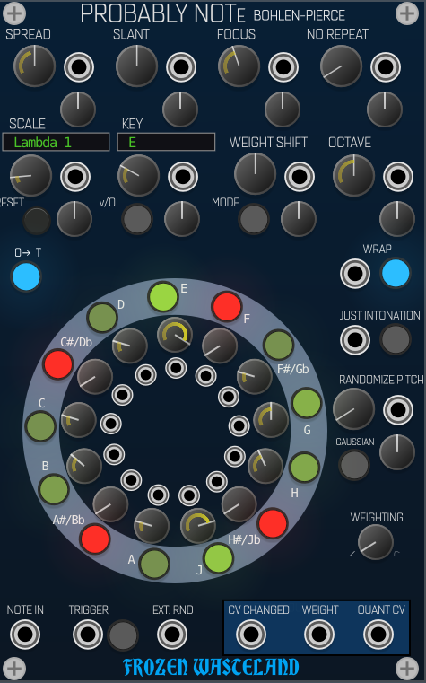

- Same basic features a Probable Not(e)
- Based on the Bohelen Pierce tuning system which uses a 3:1 "tritave" divided into 13 notes instead of the traditional 2:1 octave with 12 notes
- For reference: https://en.wikipedia.org/wiki/Bohlen%E2%80%93Pierce_scale

## Probably Not(e) - Arabic
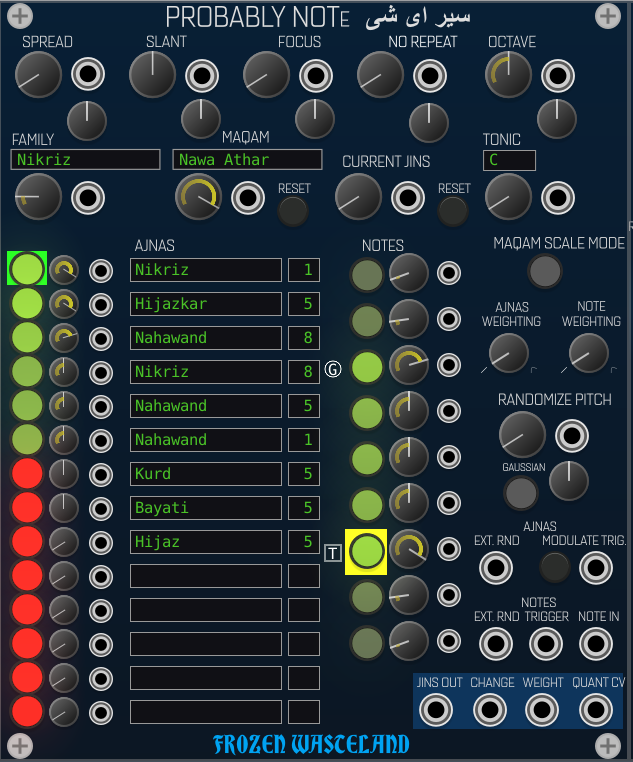
- Another probabilistic quantizer based on Arabic scales (or more accurately, Arabic jins and maqams)
- This module is based on the work of Johnny Farraj and Sami Abu Shumays. Their book Inside Arabic Music is very highly recommended (and will help understanding how this module works)
- In Maqam Scale mode, the PN-A acts like other quantizers in the Probably Note family, but uses Arabic maqams (which are made up of one or more jins)
- Much more powerful is turning off the scale mode which will then display the complete sayr - or possible modulation routes for a maqam. Since maqams in this mode do not have octave equivalence, the input is limited to -1 to 1v to determine which note to play (negative voltages choose notes below the tonic)
- Use the octave control to change octaves if needed (multi octave melodies are rare in Arabic music)
- use the tonic control to change which key the Maqam is played in (the tonic is limited to realistic values for the Maqam)
- Either use the Jins control to modulate, or even better use the modulate trigger input to use the probability to pick the next jins

## Probably Not(e) - Chord Expander

- Expander for Probably Note (original version only for now)
- The Quant output of Probably Not(e) becomes polyphonic when expander added
- This will not generate every chord that is possible, but it can create very musical sounding ones.
- Generates 4 note chords based on the root of the current PN note and using notes within the key/scale.
- Dissonance probablilty controls whether notes are randomly diminished or augmented.
- Suspension controls whether the III of scale gets changed to suspended II or IV.

## Quad Algorithmic Rhythm

- 4 Algorithmic rhythm based triggers
- 3 Algorithms, Euclidean, Golumb Ruler and Boolean. Each track can use its own Algorithm (Boolean only available on tracks 3 & 4).
- CV Control of Alogorithm. Try hooking EOC output to Algorithm trigger to get alternating rhythms
- CV control of Steps, Divisions and Offset, Padding, Accents and Accent Rotation
- QARs can be chained together to create arbitrarily long sequences. This can either be done manually by patching the appropriate outputs and input triggers together, or just by having multiple QARs be adjacent.
When they are connected this way, the Clock, Mute and Reset signals, and Eoc outputs and Start inputs are normallized, this means they are automatically patched together, but you can still override this by patching something in. Additionally the master QAR will output all of the triggers from the attached modules 
- If Chain Mode is Boss, the QAR runs on start up, then stops if the track's Start input is patched, until a Start trigger is received - basically the first QAR should be set to this
- If Chain Mode is Employee, the QAR track will be idle until a Start trigger is received.
- Patch EoC (End of Cycle) outputs to next QAR's Start Inputs
- Last QAR's EoC should be patched back to first QAR's Start Input to create a complete loop.
- May want to consider using an OR module (Qwelk has a nice one) so that mutiple QAR's outs and accent outs can gate a single unit
- Each QAR has its own clock input, so tempo changes can easily be created
- Mute Input keeps rhythm running just no output
- https://www.youtube.com/watch?v=ARMxz11z9FU is an example of how to patch a couple QARs together and drive some drum synths
- Normally each track advances one step every clock beat and are independent. If Time Sync is enabled, the selected track becomes the master and the other tracks will fit their patterns to the timing of the master. This allows for complex polyrhythms (ie. 15 on 13 on 11 on 4, etc.)
- https://www.youtube.com/watch?v=eCErJMKAlVY is an example of the QAR with Time Sync enabled
### Euclidean Rhythms
- Euclidean are based upon attempting to equally distribute the divisions among the steps available
- Basic example, with a step count of 16, and 2 divisions, the divisions will be on the 1 and the 9.
- A division of 4 would give you a basic 4 on the floor rhythm
- The Offset control lets you move the starting point of the rhythm to something other than the 1
### Golomb Ruler Rhythms
- Unlike Euclidean Rhythms which seek to evenly distribute the divisions, Golomb Rulers try to ensure unequal distribution
- Basic example, with a step count of 16, and 4 divisions, the divisions will be on the 1,4,9 and 13.
### Boolean Logic
- Uses a boolean operator to combine the previous two tracks (so 3 = 1 & 2, 4 = 2 & 3)
- Length can't be longer than shortest of the 2 tracks combined
- Division controls the logical operator.
-- 1 = AND
-- 2 = OR
-- 3 = XOR
-- 4 = NAND
-- 5 = NOR
-- 6 = NXOR
- Operators repeat if Division is past 6

## QAR Groove Expander

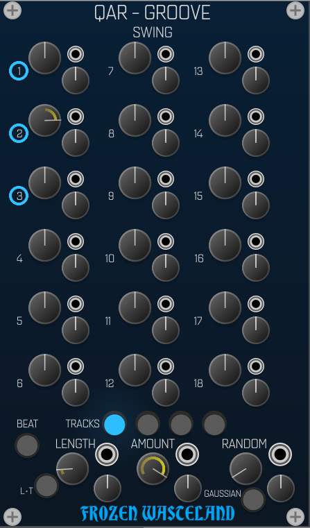

- Expander Module for Quad Algorithmic Rhythm
- Allows creating patterns that move steps before and after the beat.
- Each step can be shifted -50% to +50% of beat
- Amount interpolates between straignt time and the selected pattern
- Length sets the length of the pattern. It will repeat independently of the length of the track(s) it is applied to
- L=T sets the length of the groove to match the track(s) it is applied to
- Normally pattern is set on a step by step basis. Turning DIV on will make pattern follow the beats it is applied to.
- Random allows the beat to shift up to -50% to +50%.
- Random will work in conjunction with groove patterns
- Gaussian mode uses a distribution pattern so that most beats are close to the original
- Expanders can be chained, so putting another Groove Expander before can allow each track to have its own groove 
- Can also be chained with QAR Probability

## QAR Probability Expander

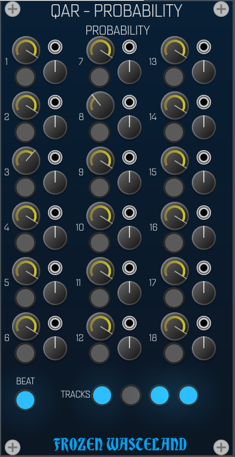

- Expander Module for Quad Algorithmic Rhythm
- Allows controlling probability on a step by step basis.
- If DIVS mode is on, then the probabilities will change the 1st beat, 2nd beat, etc no matter which step they fall on
- Buttons for each step control grouping. Each track's group is independent
- Group Mode enabled means that if the first step of group is not triggered, then other group members will not, otherwise their probability is used
- Expanders can be chained so tracks can have their own probability patterns
- Left expander has priority over expander(s) on right
- Can also be chained with QAR Groove

## QAR Warped Space Expander

- Expander Module for Quad Algorithmic Rhythm
- Allows warping the duration of beats
- The time of the track will stay constant, but some beats will be faster and others slower.
- The position control allows moving where the warped beats around

## Quantussy Cell

- This is based on work by Peter Blasser and Richard Brewster.
- Instantiate any number of cells (odd numbers work best - say 5 or 7)
- This is what is called a **Quantussy Ring**

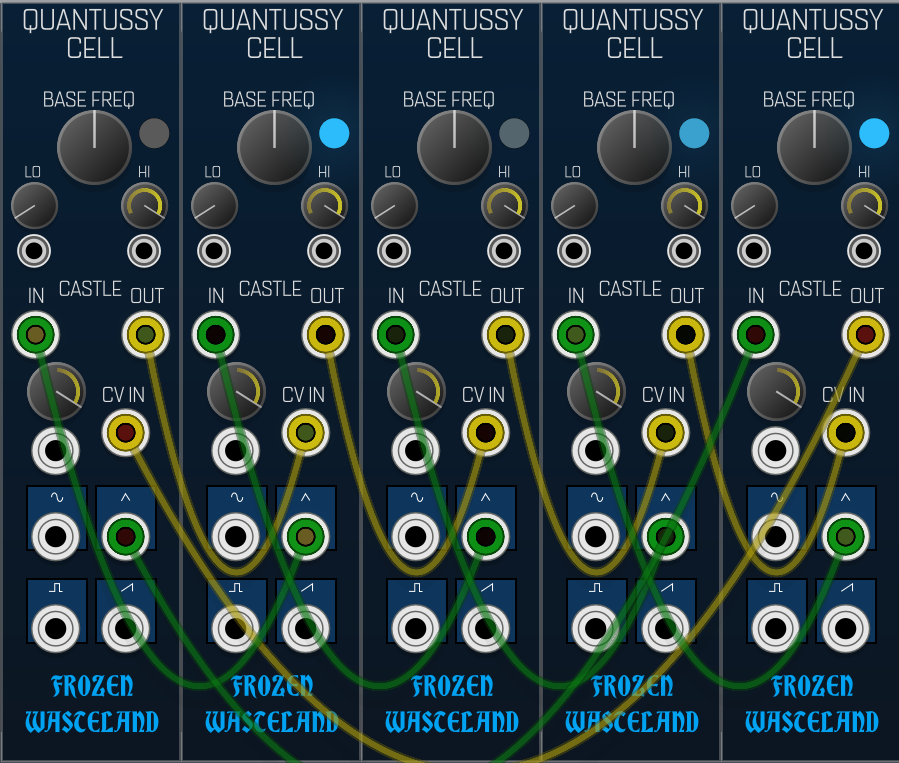

- The Freq control sets the baseline value of the internal LFO
- The Castle output should be connected to the next Cell's CV Input.
- One of the outputs (usually triangle or saw) should be connected to the next Cell's Castle input
- Repeat for each cell. The last cell is connected back to the first cell
- Use any of the remaining wav outputs from any cell to provide semi-random bordering on chaotic CV
- Check out http://pugix.com/synth/eurorack-quantussy-cells/

## Roulette LFO

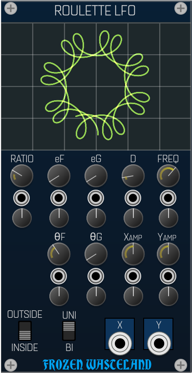

- Based on the concept of a couple different types of Roulettes: https://en.wikipedia.org/wiki/Roulette_(curve)
- A circle/ellipse rolling either inside a bigger circle/ellipse (Hypotrochoid) or circle/ellipse rolling outside a bigger circle/ellipse (Epitrochoid)
- Ratio controls the size of the big fixed shape in relation to the generating (rolling) shape
- eF and eG control the eccentricity of the fixed shape and generating (rolling) shape respectively. An eccentricity of 1 = circle
- d is the distance of the 'pen' from the center of the generating circle.
- if d = 1 the shapes become a special form of the shapes - either a Hypocycloid or Epicycloid
- θF and θG allow control of the phase of the Fixed and Generating shape respectively

## Seeds of Change

- Generates 4 pseudo-Random values and 4 pseudo-Random Gates.
- Since initial random seed can be specified by knob or CV, sequences are repeatable.
- Seed Value does not take effect until the reset button is pressed or reset trigger received.
-  

## Seeds of Change - CV Expander

- Adds 12 Additional probabilistic CV outputs to a master SoC.

## Seeds of Change - Gate Expander

- Adds 12 Additional probabilistic gate outputs to a master SoC.

## Seriously Slow LFO

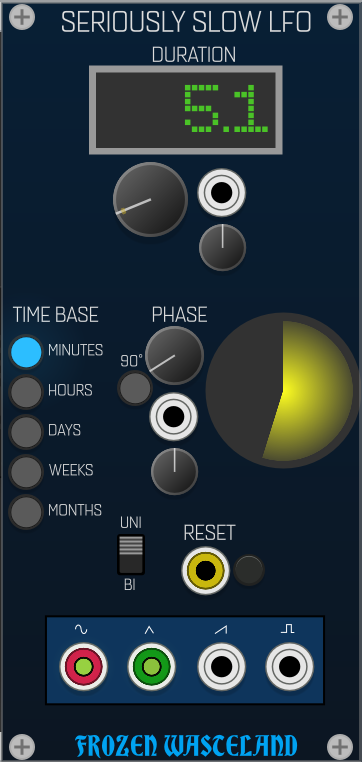

- Waiting for the next Ice Age? Tidal Modulator too fast paced? This is the LFO for you.
- Generate oscillating CVs with range from 1 minute to 100 months
- Phase Control allows LFOs to be offset (cv controllable). 90° button limits offset to 0, 90, 180, 270 degrees.
- NOTE: Pretty sure my math is correct, but 100 month LFOs have not been unit tested

## String Theory VCO

- Based on the Karplus-Strong plucked string algorithm.
- Triggering "Pluck" causes either a burst of noise or external input to be fed into a short delay line
- Source of noise is internal, but there are several noise types available (white, pink, Gaussian), unless external input is used
- Controlling the length of the delay line will change perceived pitch - longer delays = lower pitches
- Direct control of delay line length or using v/oct pitch control is possible
- Grains control allows multiple 'strings' to be plucked. Phase Offset delays each string, Spread allows each successive string to be detuned
- Feedback is internally processed through a low/higpass FILTER (12 o'clock in no filtering), but can be externally processed through FB send/return
- Feedback Shift allows the feedback of one grain to be fed into another grain
- The initial burst of noise or external input can go through a Windowing function. Green = Hanning, Blue = Blackman
- Grains can be ring modulated either against the internal noise source or an external input. RM Grains controls # of grains that are ring modulated (starting with first)

## Vox Inhumana

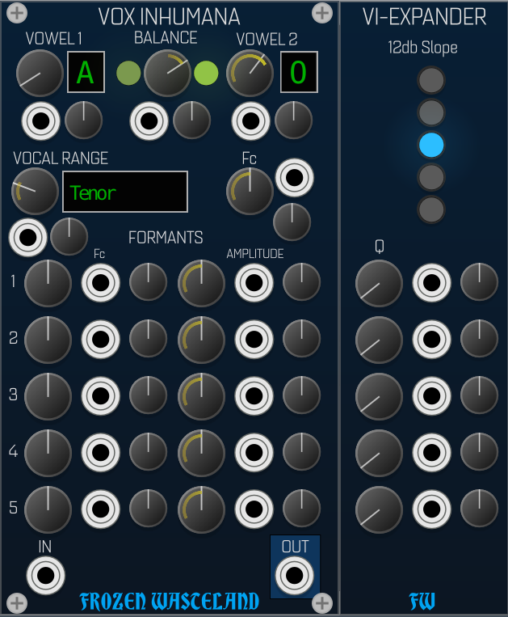

- Generates vowel-ish sounds when given harmonically rich sources
- Pairs well with the Everlasting Glottal Stopper, but sawtooth and pulse waves work well
- Vowel/Voice formants are based on https://www.classes.cs.uchicago.edu/archive/1999/spring/CS295/Computing_Resources/Csound/CsManual3.48b1.HTML/Appendices/table3.html
- Fc allows changing the frequency of all formants at once, over a large range
- The CV of a formant allows a +/- 50% change of base vowel frequency
- The CV of amplitude allows the base level of the vowel/voice to be modified by about 2x.
- Changing the Fc of formants 1 & 2 can make the vowel sound more long or short
- The expander allows CV control of the Q (resonance) of each formant, and to choose 12db/oct slope for the filters

## Contributing

I welcome Issues and Pull Requests to this repository if you have suggestions for improvement.

These plugins are released into the public domain ([CC0](https://creativecommons.org/publicdomain/zero/1.0/)).
