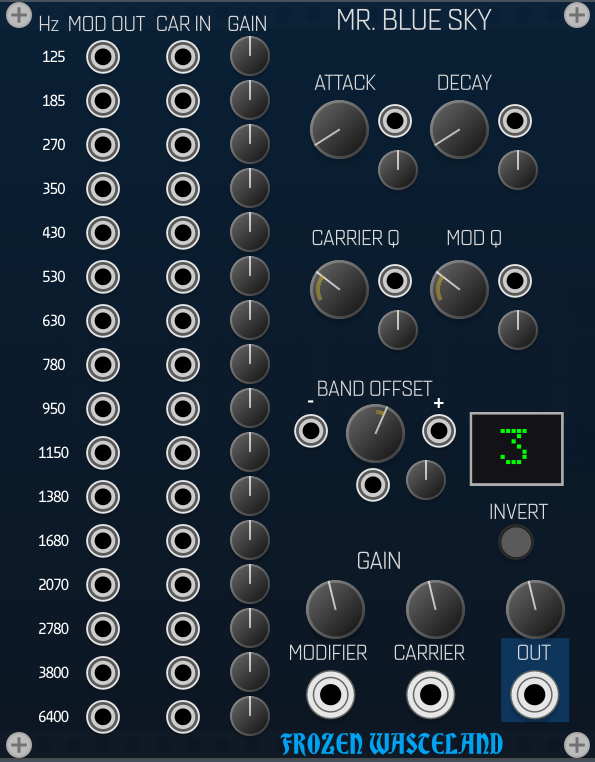
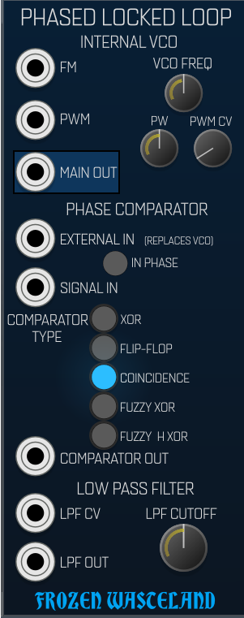

# Frozen Wasteland VCV plugins

A collection of unusual plugins that will add a certain coolness to your patches.

## Quad Eucluidean Rhythm

- 4 Euclidiean rhythm based triggers
- CV control of Steps, Divisions and Offset, Padding, Accents and Accent Rotation
- QERs can be chained together to create arbitrarily long sequences. 
- If Chain Mode is Boss, the QER runs on start up, then stops if the track's Start input is patched, until a Start trigger is received - basically the first QER should be set to this
- If Chain Mode is Employee, the QER track will be idle until a Start trigger is received.
- Patch EoC (End of Cycle) outputs to next QER's Start Inputs
- Last QER's EoC should be patched back to first QER's Start Input to create a complete loop.
- May want to consider using an OR module (Qwelk has a nice one) so that mutiple QER's outs and accent outs can gate a single unit
- Each QER has its own clock input, so tempo changes can easily be created
- https://www.youtube.com/watch?v=ARMxz11z9FU is an example of how to patch a couple QERs together and drive some drum synths

## BPM LFO

- Tempo Sync'd LFO.
- CV Control of Time Division
- Pairs well with the Quad Euclidean Rhythm

## Quantussy Cell

- This is based on work by Peter Blasser and Richard Brewster.
- Instantiate any number of cells (odd numbers work best - say 5 or 7)
- This is what is called a **Quantussy Ring**
- The Freq control sets the baseline value of the internal LFO
- The Castle output should be connected to the next Cell's CV Input.
- One of the outputs (usually triangle or saw) should be connected to the next Cell's Castle input
- Repeat for each cell. The last cell is connected back to the first cell
- Use any of the remaining wav outputs from any cell to provide semi-random bordering on chaotic CV
- Check out http://pugix.com/synth/eurorack-quantussy-cells/

## Mr. Blue Sky

- Yes, I love ELO
- This is shamelessly based on Sebastien Bouffier (bid°°)'s fantastic zINC vocoder
- Generally you patch something "synthy" to the carrier input
- The voice sample (or I like to think "harmonically interesting" source) gets patched into the Mod input
- Each modulator band is normalled to its respective carrier input, but the patch points allow you to have different bands modulate different carrier bands
- You can patch in effects (a delay, perhaps?) between the mod out and carrier in.
- CV Control of over almost everything. I highly recommend playing with the band offset.

## Lissajou LFO.

- Loosely based on ADDAC Systems now discontinued 502 module https://www.modulargrid.net/e/addac-system-addac502-ultra-lissajous
- Each LFO is actually a pair of LFOs (x and y)
- Adjusting them will show harmonic relationship between the two
- Yellow is LFO 1, Blue is LFO 2
- Output 1: (x1 + x2) / 2
- Output 2: (y1 + y2) / 2
- Output 3: (x1 + y1 + x2 + y2) / 4
- Output 4: x1/x2
- Output 5: y1/y2

## Seriously Slow LFO

- Waiting for the next Ice Age? Tidal Modulator too fast paced? This is the LFO for you.
- Generate oscillating CVs with range from 1 minute to 100 months
- NOTE: Pretty sure my math is correct, but 100 month LFOs have not been unit tested

## Phased Locked Loop (PLL)

- Inspired by Doepfer's A-196 PLL module
- This is a very weird module and can be kind of "fussy". Recommend reading http://www.doepfer.de/A196.htm
- Added CV control of the LPF that the 196 did not have
- Generally you want to "listen" to the **SQR OUT**
- You'll want to feed a Square-ish wave into Signal In
- Low **LPF FREQ** settings create a warbling effect, high = craziness
- **EXTERNAL IN** overrides interal VCO
- The **LPF OUT** is normalled to the **VCO CV**, try patching something in between the two
- Two comparator modes: XOR and D type Flip Flop
- Does not make pretty sounds, but can be a lot of fun.

## Contributing

I welcome Issues and Pull Requests to this repository if you have suggestions for improvement.

These plugins are released into the public domain ([CC0](https://creativecommons.org/publicdomain/zero/1.0/)).